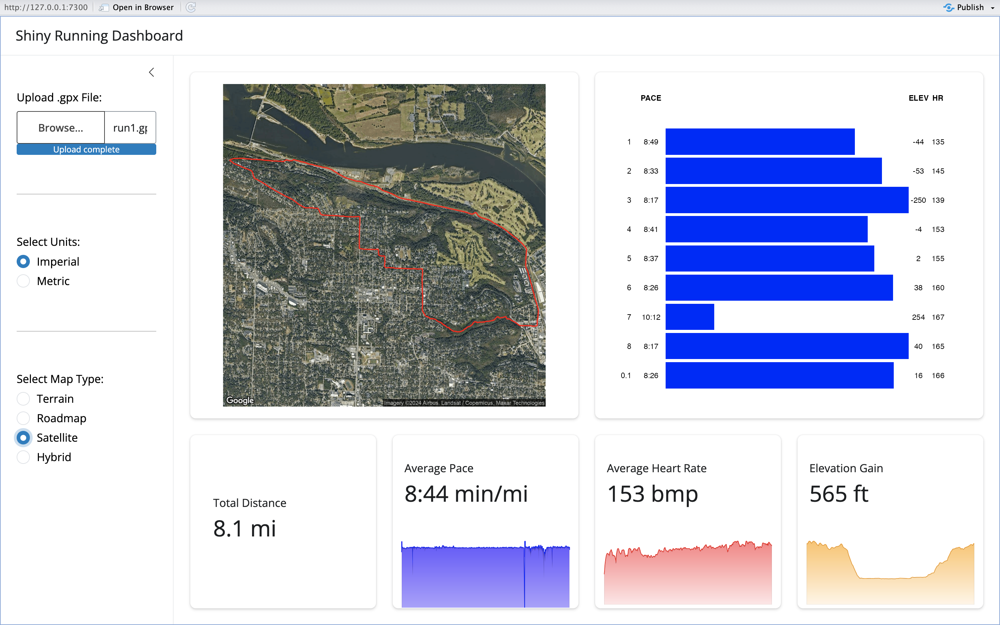

# Shiny Run Analysis Dashboard

------------------------------------------------------------------------

### Introduction

This is my first Shiny dashboard!

NOTE: This dashboard will not currently display the map imagery as is. The `ggmap` packages requires one to authenticate with Google's Static Map API in order to use its service. If you would like to implement this feature, create an `.Renviron` file in the root directory with the following code: `API_KEY = "[insert your key here]"`.

### Screenshot of Dashboard

